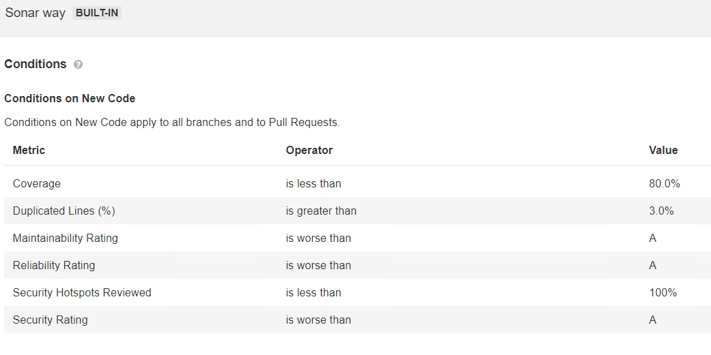

# SonarQube 

Платформа с открытым исходным кодом для непрерывного анализа и измерения качества программного кода.

У нас развернуто 2 sonarqube, тестовый и production. Доступны по следующим адресам:

- https://sonarqube-test.moscow.alfaintra.net или https://sonarqube-test
- https://sonarqube.moscow.alfaintra.net или https://sonarqube

## Основные термины

**Project** - основная сущность в sonarqube. Ближайшая аналогия - проект в bitbucket. Хранит в себе отчеты о сканировании и настройки сканирования. Каждый проект имеет project key, название, опциональные версии и ветки проекта.


**Project key** - уникальный ключ проекта. Если при первом сканировании такого ключа нет, то создастся проект. Ограничения следующие: До 400 символов. Разрешены знаки '-' (тире), '_' (нижнее подчеркивание), '.' (точка) и ':' (двоеточие), в названии должна быть хотя бы 1 буква (имя проекта в стиле 123123123 не подойдет).


**Rules** - индивидуальные правила анализа для каждого доступного языка программирования. Встроенные правила sonarway нельзя редактировать, их можно только отключить. Создать свои можно двумя [способами](https://docs.sonarqube.org/latest/extend/adding-coding-rules/): написав плагин на java, который уже при помощи api sonarqube добавит необходимые правила или через веб интерфейс для доступных языков (для которых существует template в разделе rules) при помощи правил XPath. Если оба варианта не подходят, то sonarqube допускает импорт совместимых отчетов.


**Quality profile** - набор активированных правил сканирования для выбранного языка программирования. Настроив quality profile мы можем назначить его для проекта.

**Quality gate** - набор специальных условий для нового кода, которые мы должны выполнить, чтобы проект получил положительную оценку от sonarqube. Включает такие правила как: процент покрытия тестами, количество багов, количество дублирующихся строк и другие. Настроив quality gate мы можем назначить его для проекта.



**Token** - пользовательский токен для авторизации, который мы будем использовать в процессе сканирования. Создать для вашего пользователя можно в личном кабинете в разделе security.


## Что происходит под капотом?

Сам sonarqube не выполняет анализ кода, он только импортирует отчеты сделанные встроенными  плагинами-анализаторами или внешними системами, поддерживающие совместимый формат отчета. Во время каждого анализа sonarqube получает 2 отчета: test coverage (покрытие кода) и issues (выявленные проблемы в соответствии с используемыми правилами анализа). Часто test coverage выполняется внешними инструментами, например с помощью jacoco, в таком случае sonarqube ожидает увидеть xml отчет в папке build/jacoco/html или иной, переданной в параметре sonar.coverage.jacoco.xmlReportPaths.

## Параметры для подключения

Проект в sonarqube можно создать двумя путями: из веб интерфейса при помощи add project или вызвав сканирование, используя несуществующий на платформе sonarqube ключ проекта. В наших дженкинсах уже установлен плагин интеграции с sonarqube, поэтому дополнительно устанавливать его плагины при выполнении сканирования не нужно, достаточно указать только следующие параметры:

Обязательные:

- sonar.projectKey=ключПроекта
- sonar.host.url=адресСонара
- sonar.login=вашТокен

Опциональные:

- sonar.branch.name=названиеВетки
- sonar.exclusions=Список папок, которые нужно исключить из сканирования. system/, test/, application/third_party/, application/logs/
- sonar.projectVersion=версияПроекта

## Частные случаи настроек подключения

Рассмотрим примеры выполнения сканирования в jenkins. Общий блок в jenkinsfile будет выглядить следующим образом, в зависомости от проекта нужно только адаптировать раздел script:

```shell
 environment {
        SONAR_HOST_URL = 'http://sonarqube'
        SONAR_TOKEN = 'token012345'
    }
        stage('Sonarqube') {
            steps {
                script {
                    sh(
                        script: """
                            ./gradlew sonarqube -x test \
                            -Dsonar.host.url="${SONAR_HOST_URL}" \
                            -Dsonar.login="${SONAR_TOKEN}" \
                            -Dsonar.projectKey=projectKey0123 \
                            -Dsonar.branch.name=master \
                            --stacktrace
                    """)
                } //script
            } //steps

            post {
                failure {
                    notifyBitbucketWithState('FAILED')
                }
            }
        }
```

#### Maven проект

```shell
mvn sonar:sonar \
  -Dsonar.projectKey=sonarqube-test-project \
  -Dsonar.host.url=https://sonarqube-test.moscow.alfaintra.net \
  -Dsonar.login=randomtoken0123456
```

#### Gradle проект

```shell
./gradlew sonarqube \
  -Dsonar.projectKey=sonarqube-test-project \
  -Dsonar.host.url=https://sonarqube-test.moscow.alfaintra.net \
  -Dsonar.login=randomtoken0123456
```

#### .Net core проект

Сканирование .net проекта несколько отличается и проходит в несколько этапов: begin, build и end. В end обязательно указать /d:sonar.login, в begin указываем все обязательные и опциональные параметры.

В самом базовом случае сканирование можно запустить следующим образом.

```shell
dotnet sonarscanner begin \
/k:"project-key" \
/d:sonar.login="token0123" \
/d:sonar.host.url=https://sonarqube-test.moscow.alfaintra.net

dotnet build solution.sln
dotnet sonarscanner end /d:sonar.login="token0123"
```

Рассмотрим более конкретный пример с использованием minicover (уже используется в некоторых проектах в банке). Проблема состоит в следующем: встроенные правила sonarqube не учитывают новые спецификации с#, поэтому стоит вопрос либо создания новых правил (рассмотрим пример позже), либо импорта отчетов (в определенных случаях необходимо оба варианта). Согласно [документации](https://docs.sonarqube.org/latest/analysis/test-coverage/dotnet-test-coverage/) и [документации 2](https://docs.sonarqube.org/latest/analysis/external-issues/) sonarqube для c# может импортировать внешние отчеты test coverage от следующих систем: Visual Studio Code Coverage, dotnet-coverage Code Coverage, dotCover, OpenCover, Coverlet, в иных случаях мы должны использовать [generic test coverage format](https://docs.sonarqube.org/latest/analysis/generic-test/). Issues, сгенерированные Roslyn-анализаторами импортируются по умолчанию, явно указать папку с ними можно при помощи параметра sonar.externalIssuesReportPaths. Полезным будет ознакомиться с [данным гайдом](https://community.sonarsource.com/t/coverage-troubleshooting-guide-for-net-code-coverage-import/37151) и следующим [pull-request](https://github.com/lucaslorentz/minicover/pull/30).

```shell
dotnet sonarscanner begin \
/k:"sonarqube-test-project" \
/d:sonar.host.url="https://sonarqube-test.moscow.alfaintra.net" \
/d:sonar.login="token0123456" \
/d:sonar.cs.opencover.reportsPaths="coverage.xml"
dotnet restore
dotnet build
cd tools #предполагаем, что nuget устанавливает minicover сюда
dotnet minicover" instrument --workdir ../ --assemblies MyTestFolder/**/bin/**/*.dll --sources MySrcFolder/**/*.cs 
cd ..  
dotnet test --no-build ./MyTestFolder/MyTest.csproj
cd tools 
dotnet minicover uninstrument --workdir ../
#создание отчета
dotnet minicover opencoverreport --workdir ../ --threshold 90
dotnet sonarscanner end /d:sonar.login="bfd037d66f955fbf58e26ab4b38cdf72b16f6b93"
```

У импортированных issues есть определенные [ограничения](https://docs.sonarqube.org/latest/analysis/generic-issue/) в sonarqube: мы не можем изменять их в системе (например пометить их как ложно положительные), также тогда не применяются назначенные для проекта правила сканирования (логично, ведь используются правила внешней тестирующей системы, а результат импортируется).

## Создание плагина

Рассмотрим кейс, когда команде требуется использовать свежие спецификации языка с# и при этом проходить проверки sonarqube. Командой используется roslyn-анализатор с собственными правилами [alfabank.stylecop](http://confluence.moscow.alfaintra.net/pages/viewpage.action?pageId=217979156) (по факту он состоит из нескольких анализаторов, часть которых подтягивается из репозиториев), ruleset можно увидеть (при наличии доступа) [здесь](https://git.moscow.alfaintra.net/projects/QNP/repos/alfabank.stylecop/browse/src/AlfaBank.StyleCop/content/stylecop.ruleset?at=master). Соберем на основе него плагин для sonarqube.

Необходимо:

1. Учесть [ограничения](https://github.com/SonarSource/sonarqube-roslyn-sdk/blob/master/DevNotes.txt).
2. Скачать https://github.com/SonarSource/sonarqube-roslyn-sdk (в releases есть 3.0, в branch-nuget есть 3.1, но его нужно самостоятельно скомпилировать).
3. Сконфигурировать nuget, для этого перейдем в папку скаченного roslyn-sdk, найдем NuGet.Config и пропишем следующие параметры (укажем репозиторий банка):
  ```xml
  <?xml version="1.0" encoding="utf-8"?>
  <configuration>
    <packageSources>
   <add key="public" value="https://binary.alfabank.ru/artifactory/api/nuget/nuget_public" />
    </packageSources>
  </configuration>
  ```

Если мы хотим использовать локальные файлы c заранее размещенными зависимостями, то необходимо добавить вторую строку add key вида  `<add key="nuget.org" value="c:\nuget" />`. 

Пакетный менеджер nuget хранит файлы конфигурации еще в AppData\Roaming\NuGet\NuGet.Config, в случае проблем приведите его в аналогичный вид. Кеш хранится в AppData\Local\NuGet\Cache, на случай проблем его можно заполнить отдельно заранее скаченными зависимостями.

4. Открываем командную строку windows в режиме администратора, переходим в корневую папку roslyn-sdk `CD C:\Downloads\SonarQube.Roslyn.SDK-v3.0` и выполняем следующую команду `RoslynSonarQubePluginGenerator.exe /a:AlfaBank.Stylecop /recurse /acceptLicenses`

Очень важно указать /recurse, иначе анализаторы из зависимостей не подтянутся и для них не будет создан плагин. На выходе получим 6 файлов в корне roslyn sdk: microsoftvisualstudiothreadinganalyzers-plugin-XXXX.jar, stylecopanalyzers-plugin-XXXX.jar, alfabankstylecop-plugin-XXXX.jar и и 3 соответствующих xml файла, которые дальше необходимо отредактировать, чтобы все указанные ошибки были не code smell, а что-нибудь еще. Отредактированные файлы нужно положить обратно в jar (возможно при помощи 7-z) соответвующих плагинов в папку org/plugins/roslynsdk/rules.xml. Также в официальной документации описана возможность снова запустить RoslynSonarQubePluginGenerator.exe с ключем /rules:[filename] и названием плагина, чтобы положить xml-файл с правилами автоматически.

5. После правок .xml файлов и занесения изменений в .jar мы можем перейти к установке данных плагинов в sonarqube. Для этого загружаем плагины в [репозиторий](http://binary/artifactory/devops_tools_binary/sonarqube), указываем их [в данном плейбуке](https://git.moscow.alfaintra.net/projects/DOPS/repos/ansible-sonarqube/browse/defaults/main.yml?at=refs/heads/feature/PLAT-4264)  и используем следующий [плейбук](https://git.moscow.alfaintra.net/projects/DOPS/repos/sonarqube-infra-scripts/browse) для заливки плагина и перезагрузки sonarqube. 

6. В случае успешного перезапуска sonarqube плагины будут отображаться в разделе administration > marketplace в списке всех плагинов. Импортированные правила появятся в rules, слева в фильтрах надо выбрать язык c#, ниже в фильтре repository необходимо выбрать все кроме Sonarqube C# и Common c#. Дальше необходимо будет создать с ними quality profile и назначить проекту.

   
